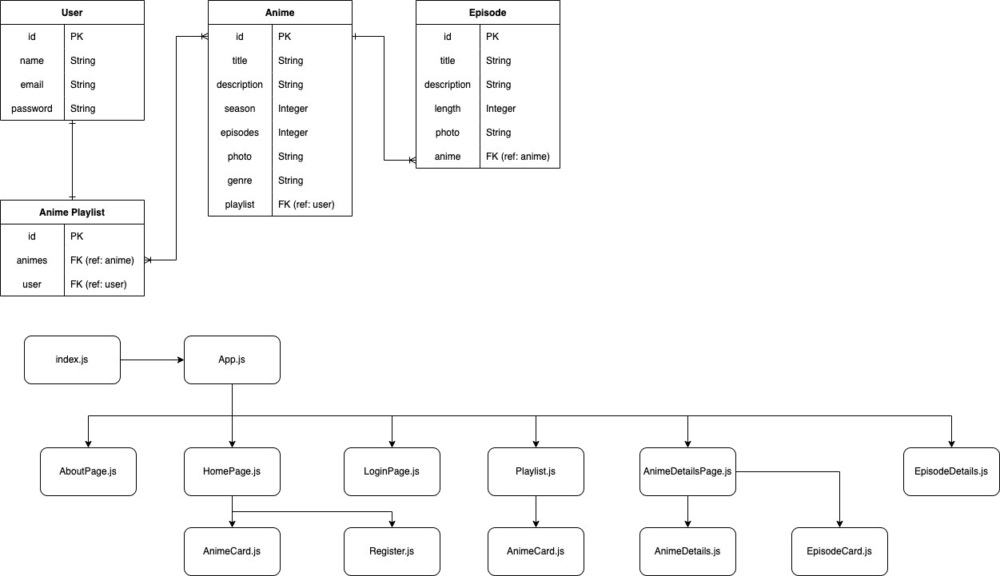

# SoggyLoaf-Server

## Date: 4/13/2022

### By: [[Canh Vo](https://www.linkedin.com/in/canhvo16/)], [[Guillermo Palencia](https://www.linkedin.com/in/guillermo-palencia/)], [[Tak Lo](linkedin.com/in/takkwanlo)]

### [Client GitHub Repository](https://github.com/canhvo16/Soggyloaf-Client), [Trello](https://trello.com/b/hqFjZAfn/soggyloaf)

---

## **_Overview_**

SoggyLoaf is a full stack PERN application inspired by crunchyroll. Users are able to setup an account with SoggyLoaf to have access to a WatchList feature where they are able to save animes they choose to watch at a later time. Regardless of having an account or not, users can still browse through the application, search for anime, and have a list of episodes that link them to the streaming site.

---

## **_Technologies_**

- React, Javascript, Html, Css
- Sequelize, Postgres
- Express
- Node.js
- Nodemon

---

## **_Screenshots_**

---

## **_Future Update_**

#### After completing this project we would love to add more features to allow more user interaction.

- Have a slideshow with the user's watchlist on the homepage
- Have a method to play the actual video on our site vs navigating to Crunchyroll
- Add more info for the user and an avatar to represent the user
- Allow users to browse for anime by genre

---

## **_Credits_**

Images: [Google](https://www.google.com/)

API: [AniList](https://anilist.co/home)
